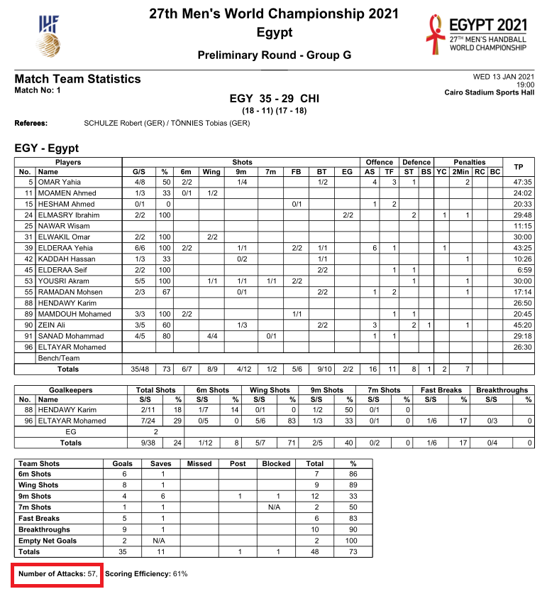
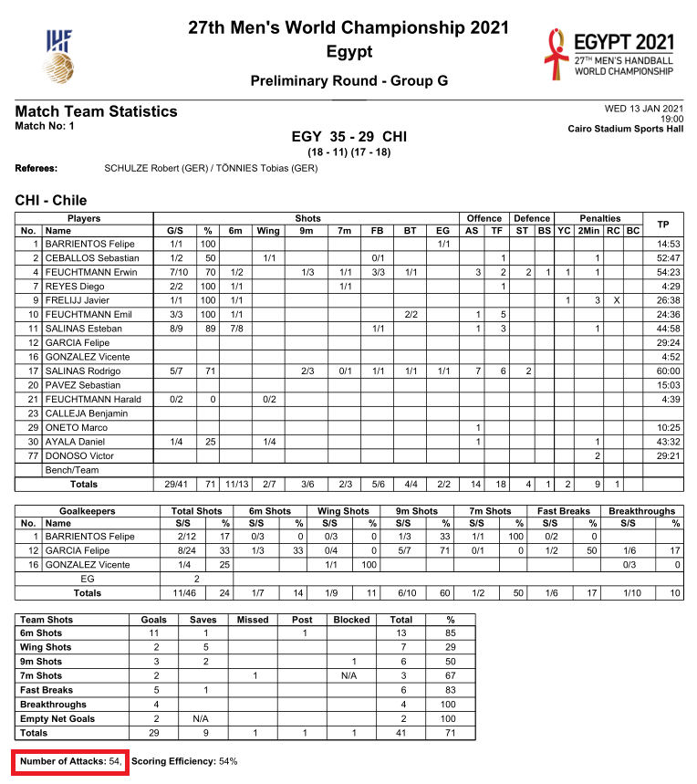

##### Nota: el código completo que genera este archivo html se puede encontrar [aquí](https://github.com/telaroz/colaborativa1/blob/master/tarea1.Rmd).


## Pregunta A: 

#### ¿Aparece en la estadística el número de posesiones del Egipto - Chile?

Sí aparece en el archivo 01FTR.pdf. Para cada equipo aparece 'Number of Attacks:'


```{r, echo = FALSE}


```

Se observa sin embargo, que estos números están incorrectos pues la máxima diferencia de posesiones en un partido es de 1. 

## Pregunta B: 

#### En caso de no aparecer el número de posesiones, ¿es posible calcularlas mediante rechaces ofensivos presentes en tabla o en listado de “jugada a jugada”?
 
 

Ya que no puede haber diferencia en posesiones de ambos equipos en más de una, el dato en el archivo FRT es incorrecto. 

En el listado de "jugada a jugada" sí se puede calcular el número de posesiones. 

Se descargan todos los archivos pdf de la página del partido con la función `scrape_from_ihf` creada en R. Se pueden ver los detalles de esta función [acá](https://github.com/telaroz/egipto21/blob/main/R/utilidades.R).


```{r eval = FALSE}
egipto21::scrape_from_ihf(
  enlace = 'https://www.ihf.info/competitions/men/308/27th-ihf-men039s-world-championship-2021/22415/match-center/22525',
  carpeta = 'scraping')
```


Para contar el número de posesiones, he generado una función `generar_pbp_tidy` de la que se pueden ver detalles [acá](https://github.com/telaroz/egipto21/blob/main/R/funciones_pbp.R): que toma el archivo en pdf que hemos descargado y convierte la tabla de jugadas a un formato 'tidy'. De esta forma, podremos trabajar nuestros datos de manera más sencilla.

Al revisar más a fondo este partido, se observa un error importante (hay otros menores) en el pdf, donde hizo falta una posesión chilena, en este caso la posesión número 101. Esta fue corregida manualmente, actualizando así el archivo .csv de este partido. El error fue encontrado, pues entre un gol de Egipto, sigue inmediatamente un tiro de Egipto, sin que haya respuesta (por pérdida, tiro, o falta técnica) de Chile. 


Veamos la cantidad de posesiones totales y la cantidad de posesiones por equipo
```{r message = TRUE, warning = FALSE}
library(magrittr)
options(digits = 3)
data <- data.table::fread('partido1_corregido.csv')

message('Cantidad total de posesiones: ', data[, data.table::uniqueN(numero_posesion)])

tabla <- data[, .(`Cantidad de posesiones` = data.table::uniqueN(numero_posesion)), 
     by = .(Equipo = posesion)]

```


```{r, echo = FALSE}
kableExtra::kable(tabla) %>%
  kableExtra::kable_styling(full_width = FALSE)
```


Se analizan más de cerca aquellas posesiones donde hay más de un tiro. Estas posesiones fueron contrastadas con el video para observar que estuvieran correctamente marcadas.

```{r}
posesiones_multi_lanzamiento <- 
  data[, .(cantidad_de_lanzamientos = sum(!is.na(gol_numero), !is.na(tiro_numero)))
       ,by =  numero_posesion
  ][cantidad_de_lanzamientos > 1]$numero_posesion


mas_de_un_tiro <- data[numero_posesion %in% posesiones_multi_lanzamiento,
     .(tiempo, accion, posesion, numero_posesion)] 


```


```{r, echo = FALSE}
  kableExtra::kable(mas_de_un_tiro) %>%
  kableExtra::kable_styling(full_width = FALSE)
```

En las posesiones 77 y 80, se hizo un tiro adicional, pero no se anotó. 


se verifican las posesiones donde se perdió balón o se hizo falta técnica, para observar si en esa misma posesión también se hizo algun tiro antes. 

```{r}
posesiones_con_perdida_y_tiro <- 
  data[numero_posesion %in% 
         data[stringr::str_detect(accion, 'Technical') | 
                !is.na(turnover)]$numero_posesion & posicion_marco != '', 
       .(tiempo, accion, posesion, numero_posesion)]
```

```{r, echo = FALSE}
  kableExtra::kable(posesiones_con_perdida_y_tiro) %>%
  kableExtra::kable_styling(full_width = FALSE)

```


Se observa que cada equipo hizo un lanzamiento y luego perdió el balón sin lograr anotar.


## Pregunta C:

#### ¿Qué formatos de estadística están disponibles? (pdf, html, csv…)


En este caso se pueden ver estadísticas generales del partido, en formato xlm. 

Además, existen 4 archivos en pdf: 

- FTR: Tiene las estadísticas de cada jugador, su tiempo de juego, posiciones de lanzamientos y salvadas del portero. Además tiene un resumen de los lanzamientos por equipo. 

- MTR: Contiene información de lanzamientos y la línea de tiempo de las anotaciones. 

- OMR: Es la planilla llena al finalizar el del partido. 

- PBP: Información jugada por jugada. 


# Pregunta D:

#### ¿Cuál consideras que fue o fueron la(s) clave(s) estadística(s) del partido? Enumera y argumenta tu perspectiva

Observemos algunas estadísticas del partido: 

```{r}
posesiones_con_lanzamiento <-
  data[, posesion_con_lanzamiento := any(posicion_marco != ''), numero_posesion
  ][,.N, .(posesion_con_lanzamiento, numero_posesion, posesion)
  ][, .(`Posesiones con lanzamiento` = sum(posesion_con_lanzamiento)),
                                    .(Equipo = posesion)] 

resumen <- data[, .(Posesiones = data.table::uniqueN(numero_posesion),
         Goles = sum(gol, na.rm = TRUE),
         `Pérdidas de balón` = sum(!is.na(turnover)),
         `Faltas técnicas` = sum(stringr::str_detect(accion, 'Technical'))),
         .(Equipo = posesion)] %>% 
  data.table::merge.data.table(posesiones_con_lanzamiento, all.x = TRUE,
                               by = 'Equipo')

efectividad <- data.table::copy(resumen)

efectividad <- 
  efectividad[, `Efectividad Tiros por Posesion` := 
                scales::percent(`Posesiones con lanzamiento`/`Posesiones`)
  ][, `Efectividad Goles por Posesion` := scales::percent(`Goles`/`Posesiones`)
  ][, `Efectividad Lanzamientos` := scales::percent(Goles/`Posesiones con lanzamiento`)
  ][,.(Equipo,  `Efectividad Tiros por Posesion`,
       `Efectividad Goles por Posesion`, `Efectividad Lanzamientos`)] %>% 
  data.table::transpose(make.names = 'Equipo', keep.names = 'Estadística')

resumen <- data.table::transpose(resumen, make.names = 'Equipo',
                                 keep.names = 'Estadística')

resumen[, diferencia := CHI - EGY]

```

```{r, echo = FALSE}
  kableExtra::kable(resumen) %>%
  kableExtra::kable_styling(full_width = FALSE)

  kableExtra::kable(efectividad) %>%
  kableExtra::kable_styling(full_width = FALSE)

```


Se puede ver que Chile hizo lanzamientos en 7 posesiones menos que Egipto. Podríamos pensar que se debe a la diferencia de pérdidas de balón únicamente, pero analicemos esto más a detalle.


Es decir, de haber dejado de perder el balón (o hecho falta técnica) 7 veces durante el partido y convertido eso en lanzamientos, Chile pudo haber estado más cerca del marcador.

Si bien las pérdidas de balón tuvieron gran importancia, es apresurado concluir que la diferencia de 6 goles se debe únicamente a eso. Supongamos una probabilidad de conversión de lanzamiento uniforme durante el partido, es decir, para Chile un 74.4%: de esta forma en 6 tiros adicionales esperaríamos 4.5 goles adicionales. 


$~$

Se calculan ahora los goles esperados, lo que dará una idea de la calidad de lanzamientos que tuvo cada equipo. Para esto, una posibilidad es tomar un marco de referencia externo al mundial, con muchos más tiros. Por ejemplo un análisis de 75,000 tiros de la Bundesliga. Estos goles esperados están mucho más detallados y segregados que aquellos que podemos tomar de los play by play de este mundial. En [este](https://handballytics.de/expected-goals-wurfeffizenz/) enlace se puede ver la tabla con goles esperados por tipo de tiro. 

Para este ejercicio, se toman todos los partidos de la fase de grupos como referencia. Si bien no es una gran cantidad de datos, es suficiente para el análisis y la creación de este modelo discreto (que con más datos, por ejemplo espaciales del punto exacto del lanzamiento o velocidad del jugador, se podría trabajar con un modelo más continuo, comparando con los que encontramos actualmente para balonmano).


Se cargan todos los partidos de la fase de grupos para analizar los tiros. Este archivo fue generado con todos los play by play de la fase de grupos gracias a la función `generar_pbp_tidy` mencionada anteriormente. Acá simplemente descargamos ese archivo y tomamos a los equipos que nos interesan.  

```{r}
partidos <- 
  data.table::fread(
    'https://raw.githubusercontent.com/telaroz/egipto21/main/partidos_fase1.csv')

equipos_analisis <- partidos[id_partido %in% c(1, 17, 18, 33, 34)]

contrincantes <- split(equipos_analisis, equipos_analisis$id_partido) %>% 
  purrr::map(~unique(.$equipo))

dt <- contrincantes %>% t() %>% data.table::as.data.table()

equipos_analisis <- split(equipos_analisis, equipos_analisis$id_partido) %>% 
  purrr::map2(contrincantes, ~ .x[,contrincante := setdiff(.y, equipo), 1:nrow(.x)]) %>% 
  data.table::rbindlist()


```


Ahora se genera la tabla de goles esperados por posición de tiro, que simplemente es la división entre la cantidad de goles anotados entre el total de tiros hecho por cada posición. 

```{r}
partidos <- partidos[,.(gol, posicion_tiro)]
partidos[is.na(gol), gol := 0]
tiros <- partidos[posicion_tiro != '']

esperados <- tiros[, .(xg = sum(gol)/.N, cantidad_tiros = .N), posicion_tiro][order(-xg)]
```


```{r, echo = FALSE}
  kableExtra::kable(esperados) %>%
  kableExtra::kable_styling(full_width = FALSE)

```


Ahora, para cada tiro, se agrega su xg. 

```{r}
data[esperados, xg := i.xg, on = 'posicion_tiro']
data[is.na(gol), gol := 0]
```

En este punto no basta sumar los goles esperados por tiro para determinar los goles esperados totales, pues esta métrica se debe hacer por posesión. De lo contrario, podríamos estar contando más de un gol por posesión. Por esto, en posesiones con múltiples tiros, calculamos los goles esperados de esa posesión como el opuesto de la probabilidad de fallar todos los tiros. Se puede resumir en una formula así: $xG_{posesion} = 1 - \prod_1^n(1-(xG_{tiro})_n)$

```{r}

pos <- data[!is.na(xg), 
            .(xg, posesion, numero_posesion, posicion_tiro, gol, equipo)]

pos[, cantidad_tiros := .N, numero_posesion]


pos[, xg_ajustado := 1 - prod(1-xg), numero_posesion]
pos[, gol_en_posesion := any(gol), numero_posesion]

xg_final <- pos[, head(.SD, 1), numero_posesion]
xg_final <- xg_final[, .(`Goles Esperados` = sum(xg_ajustado)), equipo
                   ][, Goles := data[,sum(gol), equipo]$V1
                   ][, Diferencia := Goles - `Goles Esperados`]


```

```{r, echo = FALSE}
  kableExtra::kable(xg_final) %>%
  kableExtra::kable_styling(full_width = FALSE)

```


Se observa que bajo el marco de referencia de un equipo de fase de grupos del mundial, Egipto anotó 5 goles más de lo esperado y Chile poco más de 2 goles adicionales. Comparando 5.15 y 2.43, se podría señalar que Egipto fue 2 a 3 goles más efectivo en sus tiros que Chile. 


Ahora se analizan los goles esperados y anotados de los 3 partidos de cada equipo en la fase de grupos:

```{r}
equipos_analisis[esperados, xg := i.xg, on = 'posicion_tiro']
equipos_analisis[is.na(gol), gol := 0]

goles_eq <- equipos_analisis[, .(Goles = sum(gol)), .(equipo, id_partido)]

pos_eq <- equipos_analisis[!is.na(xg), 
                           .(id_partido, xg, posesion, numero_posesion,
                             posicion_tiro, gol, equipo)]

pos_eq[, cantidad_tiros := .N, .(numero_posesion, id_partido)]


pos_eq[, xg_ajustado := 1 - prod(1-xg), .(numero_posesion, id_partido)]
pos_eq[, gol_en_posesion := any(gol), .(numero_posesion, id_partido)]

xg_final_eq <- pos_eq[, head(.SD, 1), .(numero_posesion, id_partido)]
xg_final_eq <- xg_final_eq[, .(`Goles Esperados` = sum(xg_ajustado)), .(equipo, id_partido)]

xg_final_eq[goles_eq, Goles := i.Goles, on = c('equipo', 'id_partido')
          ][, Diferencia := Goles - `Goles Esperados`]

xg_final_eq[equipos_analisis, Contrincante := i.contrincante, on = c('id_partido', 'equipo')]
xg_final_eq <- xg_final_eq[equipo %in% c('EGY', 'CHI')]
```

```{r warning=FALSE}
library(ggplot2)
plot <- ggplot(data = xg_final_eq) +
  geom_point(aes(x = `Goles Esperados`, y = Goles, 
                 color = equipo, label = Contrincante), size = 3) + 
  geom_abline() +
  theme_minimal() +
  xlim(0, 40) +
  ylim(0, 40) +
  scale_colour_manual(values = c('#cc1f12', '#0f0b0b'))

plotly::ggplotly(plot)
  
```

En este gráfico se observa que en los 3 partidos, Egipto está por encima de la línea de goles esperados. Sin embargo, Chile solamente está en esta situación justamente el partido con Egipto. Aunque la muestra es pequeña, se puede pensar que Chile fue particularmente efectivo en este partido contra Egipto. (Este gráfico es interactivo si se lee este archivo en formato html, por lo que se puede observar en cada punto de qué partido se trata y su información de goles anotados y esperados).


Se analiza ahora la efectividad de Chile por posición (en general tiros, no posesiones):

```{r}

data <- data[,.(gol, posicion_tiro)]
data[is.na(gol), gol := 0]
tiros <- data[posicion_tiro != '']

esperados_chile <- tiros[, .(xg = sum(gol)/.N, cantidad_tiros = .N), posicion_tiro
                       ][order(-xg)]

```


```{r, echo = FALSE}
  kableExtra::kable(esperados_chile) %>%
  kableExtra::kable_styling(full_width = FALSE)

```

Sin duda un partido no es una muestra suficiente, pero en este partido los lanzamientos por el centro de 9m fueron altamente utilizados y poco efectivos. Sin embargo, algunos tiros de estos fueron condicionados por la amenaza del pasivo.

Se puede analizar también la dependecia de ciertos jugadores en cada equipo. Para esto del archivo ya descargado '01FRT.PDF' se puede obtener la distribución de minutos por jugador durante este partido. Se cargan los datos, se extraen las tablas y se limpia el tiempo para obtener minutos enteros jugados. 

```{r warning = FALSE}
library(magrittr)

tables <- tabulizer::extract_tables('scraping/01FTR.PDF', method = 'stream')

equipos <- purrr::keep(tables, ~ ncol(.x) == 17) %>%
  purrr::map(data.table::as.data.table) %>% 
  purrr::map(~.x[stringr::str_detect(V1, '\\d+'),.(numero = V1, jugador = V2, Tiempo_jugado = V17)])

equipos[[1]][, Equipo := 'EGY']
equipos[[2]][, Equipo := 'CHI']


equipos <- data.table::rbindlist(equipos)

equipos[, `Tiempo jugado` := round(as.numeric(lubridate::ms(Tiempo_jugado))/60)]
equipos[, Jugador := paste(numero, '', jugador)]

equipos_limpio <- equipos[!is.na(`Tiempo jugado`)]
```

Ahora, se visualiza cómo se distribuyen los minutos por jugador (reconocimiento completo a la idea de este gráfico a Edu Agulló).

```{r}
library(ggplot2)
library(ggbeeswarm)


plot <- ggplot(equipos_limpio, aes(x = Equipo,
                                   y = `Tiempo jugado`, 
                                   col = Equipo, 
                                   label = Jugador)) +
  geom_violin(adjust = 0.75) +
  geom_beeswarm(size = 1) +
  theme_minimal() +
  scale_colour_manual(values = c('#cc1f12', '#0f0b0b'))


ggply <- plotly::ggplotly(plot, tooltip = c('x', 'label', 'y'))

ggply$x$data[[1]]$hoverinfo <- "none"
ggply$x$data[[2]]$hoverinfo <- "none"

ggply

```

Se observa que 5 jugadores chilenos tuvieron una carga mayor a los 40 minutos contra únicamente 3 jugadores de Egipto. Egipto distribuye más hacia el centro los minutos de cada uno de sus jugadores: pocos jugadores jugaron muy poco y pocos jugadores jugaron mucho.

Como conclusión se puede decir que si bien las pérdidas de balón chilenas tuvieron una influencia muy importante en el marcador final, Egipto fue más efectivo en las ocasiones que tuvo, administrando mejor sus jugadores durante el partido. 


